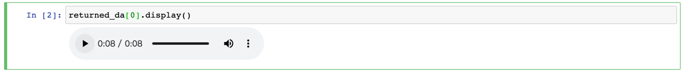

# CoquiTTS

Executor that leverages CoquiTTS engine for text2speech

## Usage

- Put your text into `Document.text`;
- Send multiple Documents into a `DocumentArray`;
- Executors will generate speech from your text and store it in `.uri` as Data URI (namely, something starts with `data:audio/wav;`)
- You can use this embedded audio in HTML. Or directly play it in Jupyter Notebook.

```python
returned_da = ...
returned_da[0].display()
```



## Sandbox

The following code can be copy-paste and run in **Jupyter Notebook/Colab** as-is:

```python
from jina import Flow, Document

f = Flow().add(uses='jinahub+sandbox://CoquiTTS7')

with f:
    r = f.post('/', Document(text='hi Alex, are you near your laptop?'))
    r[0].display()
```